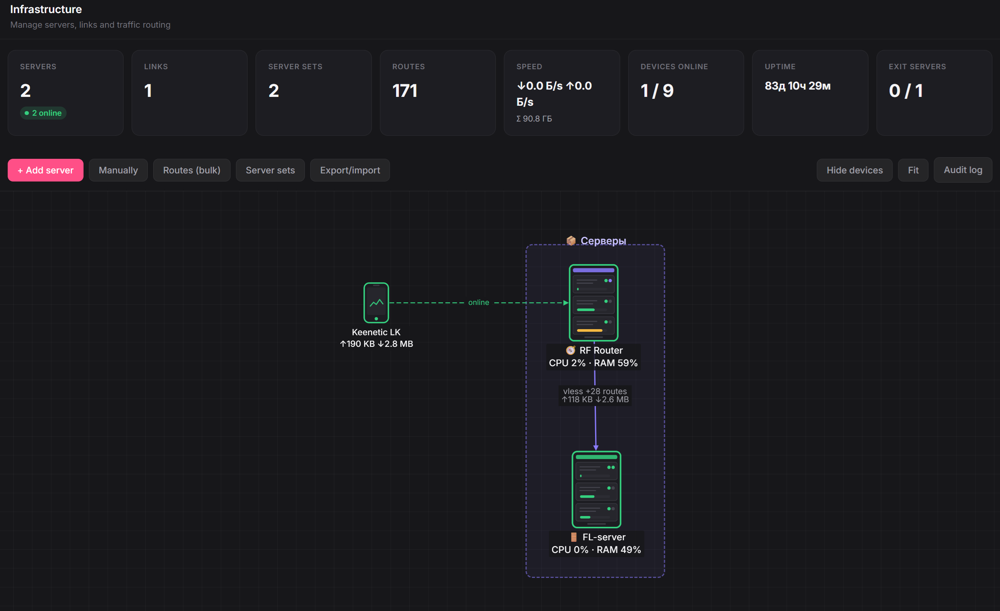

# vps_router

**English** · [Русский](README.ru.md)

**vps_router** is a PHP web panel that turns an ordinary VPS into a "smart router"
for traffic. You connect your devices to it (phone, laptop, TV, a home Keenetic
router), and the panel decides **which traffic goes where**: part of it goes
directly from the VPS itself, while selected sites (e.g. YouTube, Claude, etc.) go
through an intermediate "exit server" in another country. Everything is configured
with the mouse on a visual graph, without editing configs by hand.

It can also run as a small **service**: an optional billing module (plans,
subscribers, online payment), a self-service client portal, a visual public-site &
cabinet builder, and a module system to turn features on and off.

> In short: one entry point, rule-based selective routing, a clear server graph,
> several connection protocols and multiple routers, active protection and anti-DPI,
> an optional billing/portal, and a built-in setup wizard right in the browser.



---

## Why you'd want it

- **Selective routing.** Don't push all traffic through a remote server (that's
  slower) — only the domains/subnets you specify. Everything else goes directly and
  fast.
- **One panel instead of a dozen configs.** Servers, tunnels, routing rules and
  devices — all in a single web interface. Click "Apply" and the panel assembles the
  sing-box config itself, lays it out into files and restarts the service.
- **Visual clarity.** The infrastructure is drawn as a graph: servers, the links
  between them, server sets with automatic failover, routes.
- **Many devices and protocols.** Devices connect over VLESS+Reality (disguised as
  ordinary HTTPS), Shadowsocks, Trojan, Hysteria2 or WireGuard/AmneziaWG.
- **Keenetic router out of the box.** Route export for a home router and "smart DNS"
  so that devices behind the router (e.g. a Smart TV) work correctly.
- **Resilience built in.** Server-set failover, active reachability monitoring,
  optional anti-DPI (packet-level desync with automatic verify + rollback), and
  pre-apply warnings (broken rules, version mismatch, IPv6 leak).
- **Can run as a service.** Optional billing with online payment, a client
  self-service portal, and a visual builder for a public site and personal cabinet.
- **Modular.** Router support and extra features are modules you install, activate
  and remove right in the panel.

---

## How it works (in plain words)

```
   Your devices                 Entry VPS (panel + sing-box)            Exit servers
 ┌───────────────┐            ┌──────────────────────────────┐      ┌────────────────┐
 │ Phone         │            │                              │      │  Region A      │
 │ Laptop        │  VLESS/WG  │   sing-box (routing engine)  │──────│  Region B      │
 │ TV            │──────────▶ │   ├─ rule: youtube→exit      │ WG/  │  (any from     │
 │ Router        │            │   ├─ rule: claude→exit       │ VLESS│   the pool)    │
 └───────────────┘            │   └─ everything else → direct│      └────────────────┘
                              │                              │
                              │   PHP panel (SQLite)         │──▶ you manage it
                              └──────────────────────────────┘     from a browser
```

1. **A device** connects to the entry VPS over the chosen protocol.
2. **sing-box** on the VPS is the only engine. It looks at the domain/address of each
   connection and, by the rules from the database, decides whether to send it directly
   or into a tunnel to an exit server.
3. **The panel** does not route anything itself — it only generates the sing-box config
   (and WireGuard/AmneziaWG configs) from the database and applies it with a single
   privileged command. Switching a set's exit server is an instant change of a "label"
   in the config, not a tunnel rebuild.
4. Tunnels to exit servers stay up permanently, so switches happen without pauses.

---

## Features

### Routing & infrastructure
- Visual infrastructure **graph** (Cytoscape.js): servers, links, device nodes.
- **Rule groups**: domains, `ip_cidr` subnets and geosite categories; curated
  **presets** (YouTube, Google, etc.) and import of **external lists** (Antizapret/URL),
  optionally fetched through an exit (SOCKS) when the source is not directly reachable.
- **Server sets** with automatic **failover**; switching the active exit is an instant
  config relabel, not a tunnel rebuild.
- **Route Inspector**: "where will this domain/IP go — through which rule and exit".
- **Multi-router**: manage several router nodes from one panel.

### Devices & protocols
- Inbounds: **VLESS+Reality** (disguised as ordinary HTTPS), **Shadowsocks**, **Trojan**,
  **Hysteria2**, **WireGuard/AmneziaWG**.
- Add-device wizard: pick type and protocol → link/QR/config file.
- **Client policies** (per-device routing), **smart DNS**, ad/QUIC blocking.
- **Keenetic** route export (`.bat` with `route ADD`, ZIP splitting by the 1024-route
  limit) and **HydraRoute** export (`domain.conf` + `ip.list`); API sync.

### Observability
- Live **dashboard** KPIs (rate, devices online, uptime, exit health), **connections**
  (country flags, traffic, exit, age), **traffic** (totals / today / 30 days, by exit
  and device) and **extended per-server traffic stats**, **logs** (sing-box journal).

### Security & resilience
- **Active protection** (module): tracks exit-node reachability over time from local and
  external vantage points (early detection of availability loss by divergence) plus
  optional collection of inbound probing on the Reality port — gathered by the panel over
  outbound SSH, no agent on the exit.
- **Connection resiliency / anti-DPI**: TLS fragment on the client config, and optional
  packet-level DPI desync (**zapret/nfqws**) applied **only** to traffic to your exit
  IPs:443, with bypass and **automatic verify + rollback** if a strategy breaks the path.
- **Reality camouflage front** (optional): a disguising TLS front site (Caddy) with a
  Let's Encrypt certificate.
- **WireGuard handshake monitor**, risk/security scanners, port-knock & port-scan ban,
  **2FA (TOTP)**, encrypted SSH keys (`app_secret`), scheduled reboots and **email alerts**
  on server incidents.

### Telegram proxy (module)
- A dedicated **MTProto** (mtg, FakeTLS) and/or **SOCKS5** proxy for the Telegram
  messenger on a chosen node, managed from the server inspector: enable/disable, port,
  secret regeneration, ready-made `tg://` link and QR.

### Commercial mode (optional)
- **Billing** (paid module): plans with price (down to kopecks), traffic quota
  (fractional GB) and device limits; subscribers & subscriptions with expiry and
  **automatic device shut-off**; manual payments and online payment via gateways
  (**YooKassa / CryptoCloud**) confirmed by webhook; an **internal balance**, **add-ons**
  (extra traffic/device), **plan change** with proration, **cancellation** with partial
  refund; **email renewal reminders**.
- **Self-service portal**: subscribers sign in, confirm email, change/reset password,
  see their subscription, traffic usage and device limit, manage devices and pay online.
- **Site & cabinet builder** (paid module): a visual builder for a public landing site
  and the personal cabinet — 5 structural templates, palette/typography, hero, arbitrary
  sections, pricing cards driven by real billing data, live preview and publish, with
  host-based routing (site on your domain, panel on `panel.your-domain`).

### Modules & updates
- **Module system**: router support and extra features are modules — installed,
  activated and removed in the panel; third-party `.vmod` archives; some modules are paid
  and activated manually.
- **Update check**: compares the panel version against your repository's version file and
  shows an "update available" banner; DB migrations can be applied from the UI.

---

<details>
<summary><b>📁 Repository & file layout (click to expand)</b></summary>

### Repository root

| Path | Purpose |
|------|---------|
| `README.md` / `README.ru.md` | this file (EN / RU) |
| `LICENSE` | license (AGPLv3) |
| `deploy/` | everything for installing on servers (scripts, nginx, sudoers, provisioning) |
| `panel/` | the PHP panel code itself (deployed to the VPS at `/var/www/panel`) |

### `panel/public/` — pages (webroot)

- Core: `index.php`, `install.php` (setup wizard), `login`/`logout`, `forgot-password`,
  `reset-password`, `dashboard.php` (infrastructure graph + live KPIs).
- Routing & servers: `servers.php`, `groups.php`/`group.php` (routes, presets, import,
  Route Inspector, Keenetic/HydraRoute export), `devices.php`/`device-config.php`,
  `wg-peers.php`/`wg-peer-config.php`, `client-policy.php`.
- Observability: `traffic.php`, `connections.php`, `logs.php`, `audit.php`.
- Settings & modules: `settings.php`, `modules.php`.
- Commercial: `billing.php`, `portal.php` + `portal-login.php` / `portal-verify.php` /
  `portal-reset.php`, `site-builder.php`, `site.php` (public site / cabinet).
- `api/*.php` — JSON API for the graph and pages (servers, connections, routes, traffic,
  modules, billing-webhook, probe-intel, zapret, antidpi, tgproxy, updates, packages,
  reboot-schedule, site-domain-check, keenetic-export, etc.).
- `assets/` — static files: fonts, graph JS (Cytoscape.js), styles.

### `panel/src/` — key classes

- Config engine: `SingboxConfigBuilder` + `Singbox/*` (`ExitOutboundBuilder`,
  `RuleSetRegistry`, `RouteBuilder`, `DnsBuilder`, `InboundsBuilder`, `ConfigValidator`),
  `AmneziaConfigBuilder`, `DeviceInbounds`, `ClientPolicyBuilder`, `Applier`,
  `RealityKeys`, `CamouflageFront`.
- Nodes & provisioning: `Ssh`, `Provisioner`, `PackageManager`, `ExitServerFactory`,
  `ExitServerBalancer`, `RouterContext`, `LocalSystem`, `NetworkInfo`, `GeoIp`.
- Routing helpers: `RouteInspector`, `RoutePresets`, `ExternalListImporter`,
  `IpListImporter`, `KeeneticExport`, `KeeneticSyncService`, `HydraRouteExport`,
  `RouterExport`, `InfrastructureExport`.
- Security & resilience: `Diagnostics`, `BlockChecker`, `RiskScanner`, `SecurityAudit`,
  `ProbeIntel`, `Zapret`, `WgMonitor`, `ServerAlerts`, `ServerIncidents`,
  `ScheduledReboots`, `TgProxy`, `Secrets`, `Auth`, `Totp`.
- Traffic & versions: `TrafficCollector`, `ServerTraffic`, `TrafficSeries`,
  `UpdateChecker`, `Version`, `Installer`, `InstallRunner`, `PanelBackup`.
- Commercial: `Billing`, `Billing/*` (`PaymentGateway`, `GatewayRegistry`,
  `YooKassaGateway`, `CryptoCloudGateway`), `Portal*` (`PortalAuth`, `PortalView`,
  `PortalMail`), `FreeSubscriptions`, `Site/*` (`DesignConfig`, `TemplateRegistry`,
  `BusinessData`, `SiteContext`, `Site`, `Renderer/*` — 5 template renderers),
  `Modules/*` (`ModuleCatalog`, `ModuleManager`).
- Infra: `bootstrap.php`, `App`, `Database`, `I18n`, `View`, `Http`, `HttpResponse`,
  `Mailer`.
- `src/Models/` — `Server`, `ExitServer*`, `Connection`, `ServerSet`, `RuleGroup`/`Rule`,
  `Client`, `Policy*`, `ConfigVersion`, `NodeSetting`/`Setting`, `AuditLog`,
  `RiskScanResult`, and commercial models `Plan`, `Subscriber`, `Subscription`,
  `Payment`, `SiteDesign`, `PortalTemplate`.

### `panel/bin/` — CLI and cron

`create-admin.php`, `collect_traffic.php`, `collect_exit_load.php`, `sync-ip-lists.php`,
`free_pool_health.php`, `health_check.php`, `health_check_servers.php`, `risk_scan.php`,
`security_scan.php`, `probe_intel.php` (active protection), `check_updates.php`,
`scheduled_reboots.php`, `billing_tick.php` (expiry/reminders), plus one-off maintenance
scripts (`encrypt-exit-secrets.php`, `fix-reality-key-encoding.php`).

### `deploy/` — installing on servers

`install.sh` (interactive installer), `router/` (router-node assets: `apply-router.sh`,
sudoers, nginx vhost, firewall, hardening), `exit/` and `exit-front/` (exit-node setup,
reality front), `provision/` (`entry-vps-install.sh`, `router-apply.sh`, `exit-*.sh`,
`entry-zapret.sh`, `entry-tgproxy.sh`, `entry-wg-status.sh`, hardening, wg peers).

### `migrations/` — DB schema (31 steps, applied in order)

`001` base · `002` infrastructure graph · `003` multi-protocol · `004` route hierarchy ·
`005` wg peers · `006` port-knock · `007` client policies · `008` risk-scan / scanner ban ·
`009` login security · `010` exit-server pool & load · `011` device inbounds ·
`012` device traffic · `013` traffic totals/quota · `014` user language · `015` multi-router ·
`016` free exits · `017` 2FA (TOTP) · `018` device type · `019` exit latency · `020` modules ·
`021` scheduled reboots · `022` server incidents · `023` probe intel · `024` probe blocks ·
`025` billing · `026` billing portal · `027` portal branding · `028` portal layouts ·
`029` site designs · `030` subscriber password reset · `031` billing balance & add-ons.

</details>

<details>
<summary><b>🧩 Which additional software is used (click to expand)</b></summary>

### On the server (installed automatically by the installer)

| Software | Why | Required? |
|----------|-----|-----------|
| **PHP 8.1+** (php-fpm) + extensions `pdo_sqlite`, `sodium`, `mbstring`, `curl`, `xml` | the panel itself | yes |
| **SQLite** (via `ext-pdo_sqlite`) | the panel's database, no separate DB server needed | yes |
| **sing-box** | the routing engine (the only one) | yes |
| **nginx** | web server for the panel (a separate vhost) | yes |
| **AmneziaWG / WireGuard** (`amneziawg-tools`) | tunnels to exit servers and WG inbound | optional* |
| **nfqws** (zapret) | packet-level anti-DPI desync (only when enabled) | optional |
| **mtg** | MTProto proxy binary for the Telegram-proxy module | optional |
| **Caddy** | disguising TLS front for the Reality camouflage front | optional |
| **certbot** | free TLS certificate for the panel's / site's domain | optional |
| **fail2ban** | brute-force protection (recommended) | optional |

\* Without AmneziaWG the other protocols (VLESS, Shadowsocks, Trojan, Hysteria2) still work.

### PHP dependencies (composer)

| Package | Why |
|---------|-----|
| `phpseclib/phpseclib` | SSH/SFTP client: connection test and auto-provisioning (not via `shell_exec`) |
| `phpunit/phpunit` (dev) | tests |

### Client side (already vendored in the repo, npm not needed)

- **Cytoscape.js** + **edgehandles** — rendering of the infrastructure graph, in
  `panel/public/assets/vendor/`, no build step required.

</details>

---

## Installation — what to click where

You need a **fresh VPS** (Ubuntu/Debian or CentOS/RHEL-compatible) with root access.
A domain is optional — the panel can run over an IP.

### Step 1. Upload the code and run the installer

Copy the repository to the server (via `git clone` or `scp`) and run:

```bash
sudo bash deploy/install.sh
```

The installer will ask a few questions (you can just press Enter for the defaults):

1. **Language** — `ru` or `en`.
2. **Domain or IP** — if you have no domain, leave it empty: the panel opens on the
   server's IP.
3. The rest is automatic: it installs PHP+extensions, sing-box, (optionally) AmneziaWG,
   deploys the code to `/var/www/panel`, creates `/etc/panel/config.php`, sets up the
   nginx vhost and sudoers, and applies the DB migrations. If a domain is present it
   will offer to issue an **HTTPS certificate**.

> The installer **does not touch existing sites** — the panel lives in its own vhost,
> and the device inbound (Reality) is on a separate IP/port that you set in the wizard.

At the end it prints the address to open in the browser.

### Step 2. The visual wizard in the browser

Open the shown address (`https://your-domain` or `http://IP`). The
**setup wizard** (`install.php`) starts. Step by step:

1. **Fresh install** OR **restore from a settings backup** (if you're migrating).
2. IP auto-detection, generation of **Reality keys**, choice of connection protocols.
3. Creating the **administrator login and password**.

After it finishes, the wizard files are **removed automatically**; from then on you
sign in via `login.php`.

> If the panel runs on an IP with no domain, it works over HTTP. For HTTPS, attach a
> domain and later run `certbot --nginx -d your-domain`.

---

## After installation — what to configure

Sign in to the panel as administrator and go through the steps.

### 1. Add an exit server (where to divert traffic)

`Servers` → add an exit server (any region of your choice). Supported protocols:
`amneziawg`, `wireguard`, `vless`, `shadowsocks`, `hysteria2`, `tuic`, `trojan`.
The panel can **install the software itself** on the exit over SSH (provisioning) —
just provide server access; the SSH key is stored encrypted in the database.

### 2. Check the device inbound protocols

`Settings` → "Device connection protocols". Enable what you need (VLESS+Reality is
recommended). The panel tells you which ports to open in the host's firewall.

### 3. Create routes (what to send through the exit)

`Routes` → create a group and rules: domains (`youtube.com`), subnets (`ip_cidr`),
geosite categories. Attach the group to an exit server or to a **server set** with
automatic failover. Anything not matched by a rule goes directly from the VPS.

### 4. Add a device

`Devices` → "Add device wizard": pick the type (Phone/Tablet/Computer/Router) and the
protocol — the panel issues a link/QR/config file. If the protocol is disabled, the
wizard offers to enable it.

### 5. Apply the configuration

The **"Apply"** button. The panel assembles the sing-box config + tunnels, validates
it and restarts the service. There is a preview and a roll back to the previous version.

### Optional: modules, commercial mode and protection

- **Modules** (`Modules`): turn features on/off — active protection, extra traffic stats,
  billing, the site & cabinet builder, the Telegram proxy, router support (Keenetic /
  MikroTik / OpenWrt), update check, route presets, free public nodes. Install
  third-party `.vmod` archives here too.
- **Billing** (`Billing`, when the module is on): create plans (price, traffic quota,
  device limit), manage subscribers and subscriptions, accept manual or online payments
  (YooKassa / CryptoCloud), top up the internal balance, sell add-ons and change/cancel
  plans. Expiry shut-off and email reminders run via the `billing_tick.php` cron.
- **Self-service portal / public site** (`Site & cabinet`, when the builder module is on):
  design a public landing site and the personal cabinet, set the site domain, and let
  subscribers sign in, confirm email, manage devices and pay online.
- **Telegram proxy** (server inspector → "Telegram proxy", when the module is on): enable
  an MTProto (mtg) and/or SOCKS5 proxy on a node and share the ready-made `tg://` link/QR.
- **Active protection** (server inspector, when the module is on): monitor reachability
  over time and, optionally, collect inbound probing on the Reality port.
- **Connection resiliency / anti-DPI** (`Settings`): enable TLS fragment or packet-level
  desync (zapret/nfqws) toward your exits; a strategy is verified and rolled back
  automatically if it breaks the path.

### Useful things after launch

- **Smart DNS** (`Settings`) — DNS interception and resolving exit-bound domains through
  the exit. Fixes the case where a site won't open due to DNS substitution (e.g. YouTube
  on a Smart TV).
- **Ad / QUIC blocking** (`Settings`) — blocks ad domains and QUIC (removes video stalls
  through the proxy).
- **Keenetic router**: on the `Routes` page — export buttons. A `.bat` with `route ADD`
  commands (domains resolved to IPs, split into parts by the router's 1024-route limit —
  a ZIP if there are several parts). Next to it — HydraRoute export.
- **Route Inspector** (`Routes`) — checks "where will this domain/IP go".
- **Pre-apply warnings**: the preview flags broken references in rules, incompatibility
  with the sing-box version, questionable AmneziaWG parameters and the risk of an IPv6
  leak (if the server has a public IPv6 while the exits are IPv4-only).
- **Two-factor**: `Settings` → enable TOTP for sign-in.
- **Scheduled reboots & incident alerts**: schedule periodic reboots and get email alerts
  when a server goes down.
- **Cron** (recommended), examples:
  ```cron
  */5 * * * *  php /var/www/panel/bin/collect_traffic.php
  0 * * * *    php /var/www/panel/bin/collect_exit_load.php
  */10 * * * * php /var/www/panel/bin/probe_intel.php
  30 3 * * *   php /var/www/panel/bin/sync-ip-lists.php
  0 */6 * * *  php /var/www/panel/bin/security_scan.php
  0 */6 * * *  php /var/www/panel/bin/check_updates.php
  */5 * * * *  php /var/www/panel/bin/billing_tick.php
  * * * * *    php /var/www/panel/bin/scheduled_reboots.php
  ```
- **Update check** (`Settings` → "Updates"): point it at the RAW URL of your repo's
  version file (`panel/VERSION` or a release JSON) and the repository address. The panel
  compares versions and shows an "update available" banner, and can apply pending DB
  migrations. Updating the code itself is a deploy of a new version.
- **Admin password reset** (if forgotten), on the server:
  ```bash
  php /var/www/panel/bin/create-admin.php <login>
  ```

---

## Things you might need / FAQ

- **No domain.** Fine — the panel works over an IP via HTTP. For HTTPS you need a domain
  + `certbot`.
- **A device behind the router won't open a site (DNS error).** The device must be added
  to the tunnel on the router itself (routing policy), and enable "Smart DNS".
- **Some traffic bypasses the tunnel (IPv6 leak).** If the server/devices have a public
  IPv6 while the exits are IPv4-only, IPv6 traffic may go directly. The panel warns about
  this in the preview; the fix is to disable IPv6 on the clients or use an exit with IPv6.
- **The public site opens "a different site".** Setting the site domain in the builder is
  not enough — that hostname must also be pointed at this panel (A-record + an nginx vhost
  on the panel's docroot). The builder has a "Check domain" button that diagnoses exactly
  this (no A-record / wrong IP / another vhost serving the domain).
- **"Database is locked".** The panel already runs in WAL mode with a timeout; on bulk
  operations just retry. If PHP cached old code — restart php-fpm.
- **Changing `app_secret`.** NOT allowed on a populated database — it makes the stored SSH
  keys undecryptable. Guard it like the root password.
- **Backup.** Settings can be exported and restored through the wizard (`Settings` →
  export; at install time — "restore from backup").

---

## Development and tests

```bash
cd panel
composer install            # dependencies (+dev)
vendor/bin/phpunit          # run tests
```

The panel code uses PSR-4 autoloading (`App\` → `src/`). The only routing engine is
sing-box; the panel merely generates its config and applies it with a single argument-less
sudo command.

---

## Support the project

The project is developed in spare time. If you find it useful, you can support it:

### ❤ [Boosty — boosty.to/iygen/donate](https://boosty.to/iygen/donate)

Any donation is voluntary and grants no right to priority support; it's just a "thank
you" to the author. Thanks! 🙏

## License

Distributed under the **GNU Affero General Public License v3.0 (AGPLv3)** — see
[`LICENSE`](LICENSE).

In short: you may freely use, study and modify it. But if you modify the panel and
**provide it to others as a network service**, you must publish the source code of your
version under the same license. This protects the project from closed commercial
re-use without contributing back.

© 2026 Ygen.
