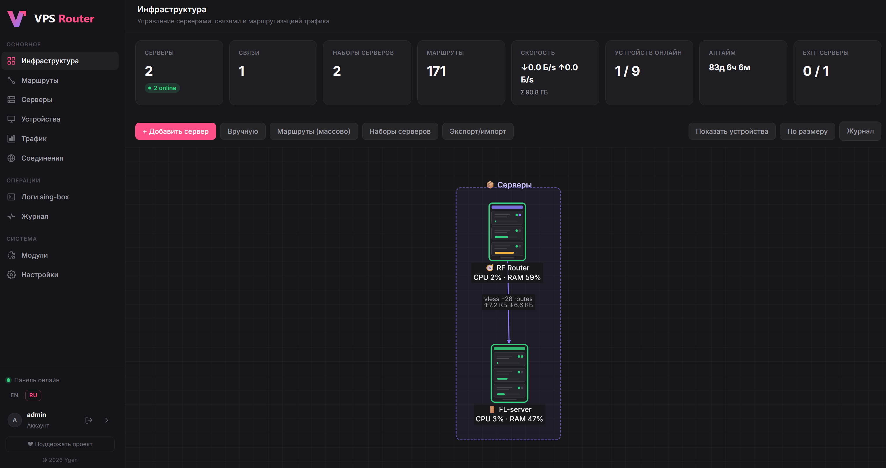

# vps_router

[English](README.md) · **Русский**

**vps_router** — это веб-панель на PHP, которая превращает обычный VPS в «умный роутер»
для трафика. Вы подключаете к нему свои устройства (телефон, ноутбук, телевизор,
домашний роутер Keenetic), а панель решает, **какой трафик куда отправить**:
часть — напрямую с самого VPS, а выбранные сайты (например YouTube, Claude и т.п.) —
через промежуточный «exit-сервер» в другой стране. Всё это настраивается мышкой
на визуальной схеме, без правки конфигов руками.

> Коротко: одна точка входа, избирательная маршрутизация по правилам, наглядный
> граф серверов, поддержка нескольких протоколов подключения и нескольких
> роутеров, встроенный мастер установки прямо в браузере.



---

## Зачем он нужен

- **Избирательная маршрутизация.** Не гонять весь трафик через удалённый сервер (это
  медленнее), а только те домены/подсети, которые вы укажете. Остальное идёт напрямую
  и быстро.
- **Одна панель вместо десятка конфигов.** Серверы, туннели, правила маршрутизации,
  устройства — всё в одном веб-интерфейсе. Нажали «Применить» — панель сама собрала
  конфиг sing-box, разложила по файлам и перезапустила службу.
- **Наглядность.** Инфраструктура рисуется графом: серверы, соединения между ними,
  наборы серверов с автопереключением (failover), маршруты.
- **Много устройств и протоколов.** Устройства подключаются по VLESS+Reality (маскируется
  под обычный HTTPS), Shadowsocks, Trojan, Hysteria2 или WireGuard/AmneziaWG.
- **Роутер Keenetic из коробки.** Есть выгрузка маршрутов для домашнего роутера
  и «умный DNS», чтобы устройства за роутером (например Smart TV) корректно работали.

---

## Как это работает (простыми словами)

```
   Ваши устройства              Входной VPS (панель + sing-box)         Exit-серверы
 ┌───────────────┐            ┌──────────────────────────────┐      ┌────────────────┐
 │ Телефон       │            │                              │      │  Регион A      │
 │ Ноутбук       │  VLESS/WG  │   sing-box (движок роутинга) │──────│  Регион B      │
 │ Телевизор     │──────────▶ │   ├─ правило: youtube→exit   │ WG/  │  (любой из     │
 │ Роутер        │            │   ├─ правило: claude→exit    │ VLESS│   пула)        │
 └───────────────┘            │   └─ остальное → напрямую    │      └────────────────┘
                              │                              │
                              │   PHP-панель (SQLite)        │──▶ вы управляете
                              └──────────────────────────────┘     через браузер
```

1. **Устройство** подключается к входному VPS по выбранному протоколу.
2. **sing-box** на VPS — единственный движок. Он смотрит на домен/адрес каждого
   соединения и по правилам из базы решает: отправить напрямую или в туннель к exit-серверу.
3. **Панель** ничего не маршрутизирует сама — она лишь генерирует конфиг sing-box
   (и конфиги WireGuard/AmneziaWG) из базы данных и применяет его одной привилегированной
   командой. Переключение exit-сервера у набора — это мгновенная смена «ярлыка» в конфиге,
   а не пересборка туннеля.
4. Туннели к exit-серверам подняты постоянно, поэтому переключения происходят без пауз.

<details>
<summary><b>📁 Какие файлы за что отвечают (нажмите, чтобы раскрыть)</b></summary>

### Корень репозитория

| Путь | Назначение |
|------|-----------|
| `README.md` | этот файл |
| `LICENSE` | лицензия |
| `deploy/` | всё для установки на серверы (скрипты, nginx, sudoers, provisioning) |
| `panel/` | сам код PHP-панели (деплоится на VPS в `/var/www/panel`) |

### `panel/` — код панели

| Путь | Назначение |
|------|-----------|
| `composer.json` / `composer.lock` | зависимости PHP (см. спойлер «ПО») |
| `config.php.example` | шаблон конфига → копируется в `/etc/panel/config.php` вне webroot |
| `phpunit.xml` | конфигурация тестов |
| `public/` | webroot — то, что видит браузер |
| `src/` | классы приложения (логика) |
| `src/Models/` | модели данных (работа с таблицами SQLite) |
| `migrations/` | SQL-миграции схемы БД (применяются по порядку) |
| `bin/` | CLI-скрипты (крон, обслуживание) |
| `lang/` | переводы интерфейса (`ru.php`, `en.php`) |
| `tests/` | PHPUnit-тесты |

### `panel/public/` — страницы (webroot)

| Файл | Назначение |
|------|-----------|
| `index.php` | точка входа / редирект |
| `install.php` | **визуальный мастер установки** (доступен, пока нет админа) |
| `login.php`, `logout.php` | вход/выход |
| `forgot-password.php`, `reset-password.php` | восстановление пароля |
| `dashboard.php` | **главный экран — граф инфраструктуры** + живые KPI (скорость, устройства онлайн, аптайм, здоровье exit'ов) |
| `servers.php` | серверы и exit-серверы |
| `groups.php`, `group.php` | маршруты (группы правил) + пресеты, импорт внешних списков, Route Inspector, выгрузка для Keenetic/HydraRoute |
| `devices.php`, `device-config.php` | устройства (иконки по типу, статус, трафик ↓↑) и мастер добавления, выдача конфигов/ссылок |
| `traffic.php` | трафик: суммарно / сегодня / 30 дней, по exit'ам, по устройствам |
| `connections.php` | живые сессии (флаги стран, трафик, exit, возраст соединения) |
| `logs.php` | просмотр журнала sing-box (journalctl) |
| `settings.php` | настройки: протоколы, блокировка рекламы/QUIC, умный DNS, приватность, смена пароля/2FA |
| `client-policy.php` | политики для клиентов |
| `wg-peers.php`, `wg-peer-config.php` | WireGuard-пиры и их конфиги |
| `audit.php` | журнал действий |
| `api/*.php` | JSON-API для графа и страниц (servers, connections, routes, traffic, keenetic-export и др.) |
| `assets/` | статика: шрифты, JS графа (Cytoscape.js), стили |

### `panel/src/` — ключевые классы

| Файл | Назначение |
|------|-----------|
| `bootstrap.php` | инициализация (автозагрузка, конфиг, сессия, i18n) |
| `App.php` | доступ к конфигу приложения |
| `Database.php` | подключение к SQLite (режим WAL, миграции) |
| `Auth.php`, `Totp.php` | аутентификация, двухфакторка (TOTP) |
| `Secrets.php` | шифрование секретов (SSH-ключи серверов) ключом `app_secret` |
| `Ssh.php` | SSH-клиент (phpseclib) — тест подключения, провижининг |
| `SingboxConfigBuilder.php` | **сборка конфига sing-box** из базы; оркестратор над `Singbox\*` (правила, DNS, inbound/outbound) |
| `Singbox/*` | модульные сборщики: `ExitOutboundBuilder`, `RuleSetRegistry`, `RouteBuilder`, `DnsBuilder`, `InboundsBuilder`, `ConfigValidator` (пред-валидация ссылок + предупреждения по версии) |
| `SingboxVersion.php`, `SingboxLog.php` | версия установленного sing-box, чтение журнала (journalctl) |
| `RouteInspector.php`, `RoutePresets.php` | «куда пойдёт домен/IP» + курируемые пресеты geosite (youtube, google и др.) |
| `ExternalListImporter.php` | импорт внешних списков (Antizapret/URL), опц. загрузка через exit (SOCKS), SSRF-guard |
| `HydraRouteExport.php` | экспорт маршрутов для HydraRoute (`domain.conf` + `ip.list` по политикам) |
| `Amnezia/AwgParams.php`, `Amnezia/AwgKernel.php` | валидация обфускации AmneziaWG, детект awg-quick/kernel-модуля |
| `LocalSystem.php` | сведения о самом узле без SSH (нагрузка, статус sing-box, публичный IPv6) |
| `AmneziaConfigBuilder.php` | сборка конфигов AmneziaWG/WireGuard |
| `Applier.php` | предпросмотр/валидация/**применение**/откат конфигурации |
| `DeviceInbounds.php` | входящие протоколы устройств (VLESS/SS/Trojan/Hysteria2/WG) |
| `ClientPolicyBuilder.php` | политики маршрутизации на уровне клиента |
| `RouterContext.php` | контекст текущего роутера (мультироутер) |
| `Provisioner.php` | автоустановка ПО на exit-серверы по SSH/SFTP |
| `ExitServerFactory.php`, `ExitServerBalancer.php` | создание/балансировка exit-серверов |
| `KeeneticExport.php` | выгрузка маршрутов для роутера (`.bat` с `route ADD`, ZIP-разбивка) |
| `KeeneticSyncService.php` | синхронизация маршрутов с Keenetic по API |
| `TrafficCollector.php`, `ServerTraffic.php` | учёт трафика устройств/серверов |
| `Installer.php` | логика мастера установки / восстановления |
| `PanelBackup.php` | резервная копия настроек панели |
| `Diagnostics.php`, `BlockChecker.php`, `NetworkInfo.php` | диагностика доступности, определение IP |
| `RiskScanner.php`, `SecurityAudit.php` | сканеры рисков/безопасности |
| `IpListImporter.php`, `FreeSubscriptions.php` | импорт списков IP, бесплатные подписки/пулы |
| `I18n.php`, `View.php` | локализация и рендеринг страниц |
| `Http.php`, `Mailer.php` | HTTP-хелперы, отправка почты |

### `panel/src/Models/` — модели БД

`Server`, `ExitServer`, `ExitServerPeer`, `ExitServerLoad`, `Connection`,
`ServerSet` (набор серверов), `RuleGroup` / `Rule` (маршруты), `Client` (устройство),
`PolicyProfile` / `PolicyDevice` / `PolicyVersion` (политики), `ConfigVersion` (версии конфига),
`NodeSetting` / `Setting` (настройки узла/глобальные), `AuditLog` (журнал), `RiskScanResult`.

### `panel/bin/` — CLI и крон

| Файл | Назначение |
|------|-----------|
| `create-admin.php` | создать/сбросить администратора |
| `collect_traffic.php` | собрать трафик устройств (крон) |
| `collect_exit_load.php` | собрать нагрузку exit-серверов (крон) |
| `sync-ip-lists.php` | обновить списки IP-подсетей (крон) |
| `free_pool_health.php`, `health_check.php`, `health_check_servers.php` | проверки здоровья |
| `risk_scan.php`, `security_scan.php` | сканы рисков и обновлений (крон) |
| `encrypt-exit-secrets.php`, `fix-reality-key-encoding.php` | разовые обслуживающие скрипты |

### `deploy/` — установка на серверы

| Путь | Назначение |
|------|-----------|
| `install.sh` | **интерактивный установщик** на свежий VPS (`sudo bash deploy/install.sh`) |
| `router/` | всё для узла-роутера: `apply-router.sh`, sudoers, nginx-vhost, firewall, hardening, README |
| `exit/` | инструкция по настройке exit-узла |
| `exit-front/` | exit с маскировочным TLS-фронтом (reality-front) |
| `provision/` | скрипты автоустановки: установка ПО на узел, `router-apply.sh`, `exit-*.sh`, hardening, wg-пиры |

### `migrations/` — схема БД (по порядку)

`001` базовая · `002` инфраструктура (граф) · `003` мультипротокол · `004` иерархия
маршрутов · `005` wg-пиры · `006` port-knock · `007` политики клиента · `008` риск-скан/бан
сканеров · `009` безопасность входа · `010` пул exit-серверов и нагрузка · `011` inbound
устройств · `012` трафик устройств · `013` тотал/квоты трафика · `014` язык пользователя ·
`015` мультироутер · `016` бесплатные exit-ы · `017` двухфакторка (TOTP).

</details>

<details>
<summary><b>🧩 Какое дополнительное ПО используется (нажмите, чтобы раскрыть)</b></summary>

### На сервере (ставит установщик автоматически)

| ПО | Зачем | Обязательно? |
|----|-------|--------------|
| **PHP 8.1+** (php-fpm) + расширения `pdo_sqlite`, `sodium`, `mbstring`, `curl`, `xml` | сама панель | да |
| **SQLite** (через `ext-pdo_sqlite`) | база данных панели, отдельный сервер БД не нужен | да |
| **sing-box** | движок маршрутизации (единственный) | да |
| **nginx** | веб-сервер для панели (отдельный vhost) | да |
| **AmneziaWG / WireGuard** (`amneziawg-tools`) | туннели к exit-серверам и вход по WG | опционально* |
| **certbot** | бесплатный TLS-сертификат для домена панели | опционально |
| **fail2ban** | защита от брутфорса (рекомендуется) | опционально |

\* Без AmneziaWG остальные протоколы (VLESS, Shadowsocks, Trojan, Hysteria2) работают.

### PHP-зависимости (composer)

| Пакет | Зачем |
|-------|-------|
| `phpseclib/phpseclib` | SSH/SFTP-клиент: тест подключения к серверам и автопровижининг (не через `shell_exec`) |
| `phpunit/phpunit` (dev) | тесты |

### Клиентская часть (уже вендорена в репозитории, npm не нужен)

- **Cytoscape.js** + **edgehandles** — рендеринг графа инфраструктуры. Лежат в
  `panel/public/assets/vendor/`, сборка не требуется.

</details>

---

## Установка — что куда нажимать

Нужен **свежий VPS** (Ubuntu/Debian или CentOS/RHEL-совместимый) с root-доступом.
Домен не обязателен — панель может работать по IP.

### Шаг 1. Заливаем код и запускаем установщик

Скопируйте репозиторий на сервер (через `git clone` или `scp`) и запустите:

```bash
sudo bash deploy/install.sh
```

Установщик задаст вопросы (можно жать Enter — подставит значения по умолчанию):

1. **Язык** — `ru` или `en`.
2. **Домен или IP** — если домена нет, оставьте пустым: панель откроется по IP сервера.
3. Дальше он сам: поставит PHP+расширения, sing-box, (по желанию) AmneziaWG, развернёт
   код в `/var/www/panel`, создаст `/etc/panel/config.php`, настроит nginx-vhost и sudoers,
   применит миграции БД. При наличии домена предложит выпустить **HTTPS-сертификат**.

> Установщик **не трогает существующие сайты** — панель живёт отдельным vhost'ом, а
> вход устройств (Reality) — на отдельном IP/порту, который вы зададите в мастере.

В конце он напишет адрес, который надо открыть в браузере.

### Шаг 2. Визуальный мастер в браузере

Откройте показанный адрес (`https://ваш-домен` или `http://IP`). Запустится
**мастер установки** (`install.php`). В нём по шагам:

1. **Установка с нуля** ИЛИ **восстановление из копии настроек** (если переезжаете).
2. Автоопределение IP, генерация **Reality-ключей**, выбор протоколов подключения.
3. Создание **логина и пароля администратора**.

После завершения файлы мастера **удаляются автоматически**, дальше вход — через `login.php`.

> Если панель на IP без домена — она работает по HTTP. Для HTTPS привяжите домен и
> позже выполните `certbot --nginx -d ваш-домен`.

---

## После установки — что настроить

Зайдите в панель под администратором и пройдите по шагам.

### 1. Добавьте exit-сервер (куда уводить трафик)

`Серверы` → добавить exit-сервер (любой регион на ваш выбор). Поддерживаются протоколы
`amneziawg`, `wireguard`, `vless`, `shadowsocks`, `hysteria2`, `tuic`, `trojan`.
Панель может **сама установить ПО** на exit по SSH (провижининг) — для этого укажите
доступ к серверу; SSH-ключ хранится в БД в зашифрованном виде.

### 2. Проверьте протоколы входа устройств

`Настройки` → «Протоколы подключения устройств». Включите нужные (VLESS+Reality —
рекомендуется). Порты, которые надо открыть в firewall хостера, панель подскажет.

### 3. Создайте маршруты (что уводить через exit)

`Маршруты` → создайте группу и правила: домены (`youtube.com`), подсети (`ip_cidr`),
geosite-категории. Привяжите группу к exit-серверу или к **набору серверов** (Server Set)
с автопереключением. Всё, что не попало в правила, идёт напрямую с VPS.

### 4. Добавьте устройство

`Устройства` → «Мастер добавления устройства»: выберите тип (Телефон/Планшет/Компьютер/Роутер),
протокол — панель выдаст ссылку/QR/файл конфигурации. Если протокол выключен, мастер
предложит включить его.

### 5. Примените конфигурацию

Кнопка **«Применить»**. Панель соберёт конфиг sing-box + туннели, провалидирует и
перезапустит службу. Есть предпросмотр и откат к предыдущей версии.

### Полезное после запуска

- **Умный DNS** (`Настройки`) — перехват DNS и резолв «заграничных» доменов через exit.
  Лечит ситуацию, когда сайт не открывается из-за подмены DNS (например YouTube на Smart TV).
- **Блокировка рекламы / QUIC** (`Настройки`) — режет рекламные домены и QUIC (убирает
  зависания видео через прокси).
- **Роутер Keenetic**: на странице `Маршруты` — кнопки выгрузки. `.bat` с командами
  `route ADD` (домены резолвятся в IP, файл автоматически бьётся на части по лимиту
  роутера в 1024 маршрута — если частей несколько, скачается ZIP). Рядом — экспорт для
  HydraRoute (`domain.conf` + `ip.list` по политикам).
- **Пресеты и внешние списки** (`Маршруты`) — быстрые наборы geosite (YouTube, Google и
  др.) и импорт внешних списков (Antizapret/URL). Если сайт-источник сам недоступен
  напрямую, включите загрузку списка через exit (SOCKS).
- **Route Inspector** (`Маршруты`) — проверка «куда пойдёт этот домен/IP»: через какое
  правило и какой exit.
- **Живые данные**: `Дашборд` — скорость/устройства онлайн/аптайм/здоровье exit'ов;
  `Соединения` — активные сессии; `Трафик` — суммы и разбивка; `Логи` — журнал sing-box.
- **Предупреждения перед применением**: предпросмотр отмечает битые ссылки в правилах,
  несовместимость с версией sing-box, спорные параметры AmneziaWG и риск утечки по IPv6
  (если у сервера есть публичный IPv6, а exit'ы только IPv4).
- **Двухфакторка**: `Настройки` → включить TOTP для входа.
- **Крон** (рекомендуется), примеры:
  ```cron
  */5 * * * *  php /var/www/panel/bin/collect_traffic.php
  0 * * * *    php /var/www/panel/bin/collect_exit_load.php
  30 3 * * *   php /var/www/panel/bin/sync-ip-lists.php
  0 */6 * * *  php /var/www/panel/bin/security_scan.php
  0 */6 * * *  php /var/www/panel/bin/check_updates.php
  ```
- **Проверка обновлений** (`Настройки` → «Обновления»): укажите RAW-URL файла версии
  вашего репозитория (`panel/VERSION` или JSON релиза) и адрес репозитория. Панель сверит
  версии и покажет баннер «доступно обновление». Обновление кода — это деплой новой версии;
  миграции БД после выкладки применяются автоматически.
- **Сброс пароля админа** (если забыли), на сервере:
  ```bash
  php /var/www/panel/bin/create-admin.php <логин>
  ```

---

## Что может потребоваться / частые вопросы

- **Нет домена.** Ок — панель работает по IP по HTTP. Для HTTPS нужен домен + `certbot`.
- **Устройство за роутером не открывает сайт (ошибка DNS).** Устройство должно быть
  заведено в туннель на самом роутере (политика маршрутизации), плюс включите «Умный DNS».
- **Часть трафика идёт мимо туннеля (утечка по IPv6).** Если у сервера/устройств есть
  публичный IPv6, а exit'ы работают только по IPv4, IPv6-трафик может пойти напрямую.
  Панель предупредит об этом в предпросмотре; решение — отключить IPv6 на клиентах либо
  использовать exit с IPv6.
- **«Database is locked».** Панель уже в режиме WAL с таймаутом; при массовых операциях
  просто повторите. Если PHP кешировал старый код — перезапустите php-fpm.
- **Смена `app_secret`.** НЕЛЬЗЯ на заполненной базе — сделает сохранённые SSH-ключи
  нерасшифровываемыми. Берегите его как пароль root.
- **Резервная копия.** Настройки можно выгрузить и восстановить через мастер (`Настройки` →
  экспорт; при установке — «восстановление из копии»).

---

## Разработка и тесты

```bash
cd panel
composer install            # зависимости (+dev)
vendor/bin/phpunit          # прогнать тесты
```

Код панели — PSR-4 автозагрузка (`App\` → `src/`). Единственный движок маршрутизации —
sing-box; панель только генерирует его конфиг и применяет одной sudo-командой без аргументов.

---

## Поддержать проект

Проект развивается в свободное время. Если он вам полезен — можно поддержать:

### ❤ [Boosty — boosty.to/iygen/donate](https://boosty.to/iygen/donate)

Любой донат — добровольный и не даёт прав на приоритетную поддержку; это просто
«спасибо» автору. Спасибо! 🙏

## Лицензия

Распространяется под **GNU Affero General Public License v3.0 (AGPLv3)** — см.
[`LICENSE`](LICENSE).

Коротко: можно свободно пользоваться, изучать и дорабатывать. Но если вы
изменяете панель и **предоставляете её другим как сетевой сервис**, вы обязаны
опубликовать исходный код своей версии под той же лицензией. Это защищает проект
от закрытой коммерческой переработки без вклада обратно.

© 2026 Ygen.
